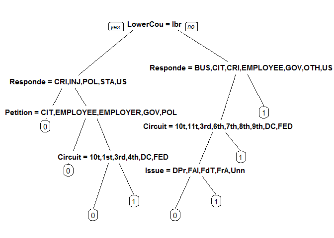
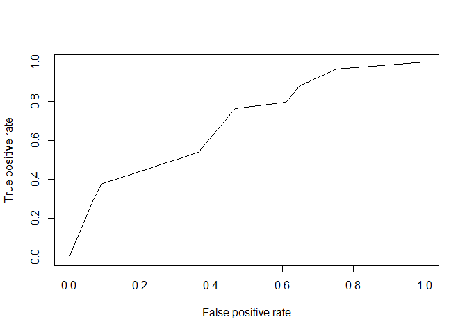
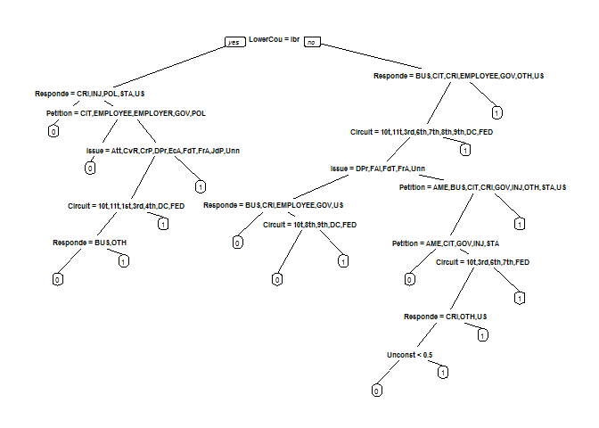
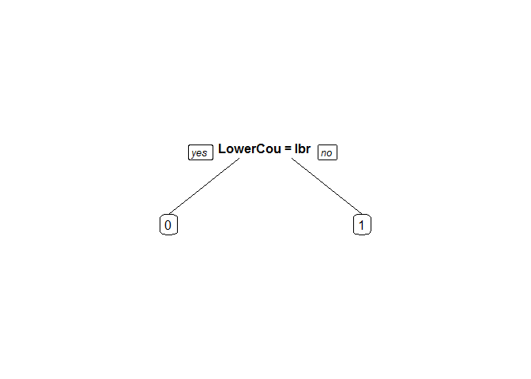
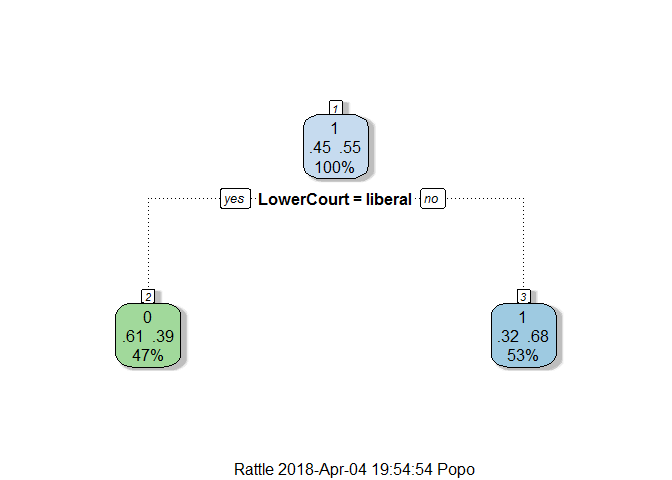
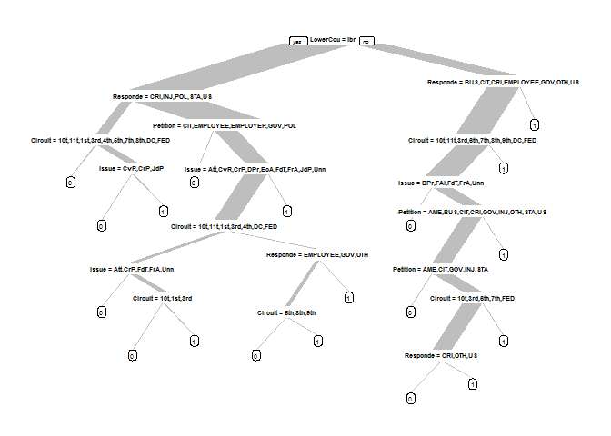
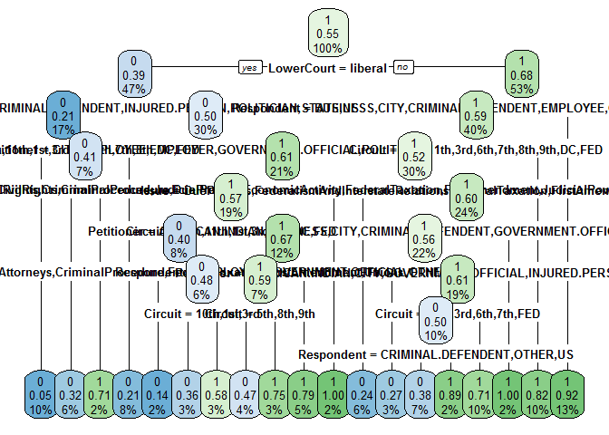
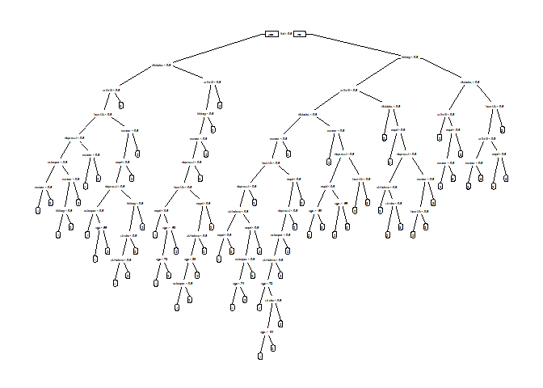

R Notebook
================

``` r
# install.packages("rpart.plot")
library(rpart.plot)
```

    ## Loading required package: rpart

``` r
library(rpart)
library(rattle)
```

    ## Warning: package 'rattle' was built under R version 3.4.4

    ## Rattle: A free graphical interface for data science with R.
    ## Version 5.1.0 Copyright (c) 2006-2017 Togaware Pty Ltd.
    ## Type 'rattle()' to shake, rattle, and roll your data.

``` r
stevens = read.csv("https://prod-edxapp.edx-cdn.org/assets/courseware/v1/80dfa0ae5eb3fa2013a34507cd58fabb/asset-v1:MITx+15.071x+2T2017+type@asset+block/stevens.csv")
head(stevens)
```

    ##    Docket Term Circuit            Issue Petitioner Respondent LowerCourt
    ## 1 93-1408 1994     2nd EconomicActivity   BUSINESS   BUSINESS    liberal
    ## 2 93-1577 1994     9th EconomicActivity   BUSINESS   BUSINESS    liberal
    ## 3 93-1612 1994     5th EconomicActivity   BUSINESS   BUSINESS    liberal
    ## 4  94-623 1994     1st EconomicActivity   BUSINESS   BUSINESS     conser
    ## 5 94-1175 1995     7th    JudicialPower   BUSINESS   BUSINESS     conser
    ## 6  95-129 1995     9th EconomicActivity   BUSINESS   BUSINESS     conser
    ##   Unconst Reverse
    ## 1       0       1
    ## 2       0       1
    ## 3       0       1
    ## 4       0       1
    ## 5       0       1
    ## 6       1       0

``` r
# install.packages("caTools")
library(caTools)
set.seed(3000)
spl = sample.split(stevens$Reverse,SplitRatio = .7)
Train = subset(stevens,spl==T)
Test = subset(stevens,spl==F)
head(Test)
```

    ##     Docket Term Circuit            Issue     Petitioner Respondent
    ## 1  93-1408 1994     2nd EconomicActivity       BUSINESS   BUSINESS
    ## 3  93-1612 1994     5th EconomicActivity       BUSINESS   BUSINESS
    ## 4   94-623 1994     1st EconomicActivity       BUSINESS   BUSINESS
    ## 6   95-129 1995     9th EconomicActivity       BUSINESS   BUSINESS
    ## 8  96-1768 1997     9th EconomicActivity       BUSINESS   BUSINESS
    ## 21 97-1704 1998     5th    JudicialPower INJURED.PERSON   BUSINESS
    ##    LowerCourt Unconst Reverse
    ## 1     liberal       0       1
    ## 3     liberal       0       1
    ## 4      conser       0       1
    ## 6      conser       1       0
    ## 8      conser       1       1
    ## 21    liberal       1       0

``` r
set.seed(3000)
StevensTree = rpart(Reverse~Circuit + Issue + Petitioner + Respondent + LowerCourt + Unconst,data=Train,method="class",minbucket = 25)

prp(StevensTree)
```



``` r
PredictCART = predict(StevensTree,newdata=Test,type='class')
table(Test$Reverse,PredictCART)
```

    ##    PredictCART
    ##      0  1
    ##   0 41 36
    ##   1 22 71

``` r
#accuracy
(41+71)/(41+22+36+71)
```

    ## [1] 0.6588235

``` r
library(ROCR)
```

    ## Loading required package: gplots

    ## 
    ## Attaching package: 'gplots'

    ## The following object is masked from 'package:stats':
    ## 
    ##     lowess

``` r
PredictROC = predict(StevensTree,newdata = Test)
head(PredictROC)
```

    ##            0         1
    ## 1  0.3035714 0.6964286
    ## 3  0.3035714 0.6964286
    ## 4  0.4000000 0.6000000
    ## 6  0.4000000 0.6000000
    ## 8  0.4000000 0.6000000
    ## 21 0.3035714 0.6964286

``` r
pred =prediction(PredictROC[,2],Test$Reverse)
perf = performance(pred,"tpr","fpr")
plot(perf)
```



``` r
as.numeric(performance(pred, "auc")@y.values)
```

    ## [1] 0.6927105

Add a new chunk by clicking the *Insert Chunk* button on the toolbar or by pressing *Ctrl+Alt+I*.

``` r
set.seed(3000)
StevensTree1 = rpart(Reverse~Circuit + Issue + Petitioner + Respondent + LowerCourt + Unconst,data=Train,method="class",minbucket = 5)

prp(StevensTree1)
```



``` r
#Overfitting may occur
```

``` r
set.seed(3000)
StevensTree2 = rpart(Reverse~Circuit + Issue + Petitioner + Respondent + LowerCourt + Unconst,data=Train,method="class",minbucket = 100)

prp(StevensTree2)
```



``` r
#simple tree with no predictive value 
```

``` r
# install.packages("randomForest")
library(randomForest)
```

    ## Warning: package 'randomForest' was built under R version 3.4.4

    ## randomForest 4.6-14

    ## Type rfNews() to see new features/changes/bug fixes.

    ## 
    ## Attaching package: 'randomForest'

    ## The following object is masked from 'package:rattle':
    ## 
    ##     importance

``` r
Train$Reverse = as.factor(Train$Reverse)
set.seed(200)
StevensForest=randomForest(Reverse~Circuit+Issue+Petitioner+Respondent+LowerCourt+Unconst,data =Train,nodesize=25,ntree=200)
PredictForest = predict(StevensForest,newdata = Test)
table(Test$Reverse,PredictForest)
```

    ##    PredictForest
    ##      0  1
    ##   0 43 34
    ##   1 18 75

``` r
#May not be the same as the course as there is a random component in using randomForest. Consider using set.seed() for uniformity sake
(44+76)/(43+73+20+34)
```

    ## [1] 0.7058824

``` r
#
```

``` r
# install.packages("caret")
# install.packages("e1071")
# install.packages("ggplot2")
library(e1071)
library(caret)
```

    ## Loading required package: lattice

    ## Loading required package: ggplot2

    ## Warning: package 'ggplot2' was built under R version 3.4.4

    ## 
    ## Attaching package: 'ggplot2'

    ## The following object is masked from 'package:randomForest':
    ## 
    ##     margin

``` r
numFolds = trainControl(method='cv',number=10)
cpGrid = expand.grid(.cp=seq(0.01,0.5,0.01))
train(Reverse~Circuit+Issue+Petitioner+Respondent+LowerCourt+Unconst,
      data = Train,
      method = "rpart",
      trControl=numFolds,
      tuneGrid=cpGrid)
```

    ## CART 
    ## 
    ## 396 samples
    ##   6 predictor
    ##   2 classes: '0', '1' 
    ## 
    ## No pre-processing
    ## Resampling: Cross-Validated (10 fold) 
    ## Summary of sample sizes: 356, 357, 356, 356, 356, 356, ... 
    ## Resampling results across tuning parameters:
    ## 
    ##   cp    Accuracy   Kappa       
    ##   0.01  0.6208333   0.220666218
    ##   0.02  0.6257692   0.232410416
    ##   0.03  0.6207692   0.228557541
    ##   0.04  0.6233333   0.236189388
    ##   0.05  0.6436538   0.282368078
    ##   0.06  0.6436538   0.282368078
    ##   0.07  0.6436538   0.282368078
    ##   0.08  0.6436538   0.282368078
    ##   0.09  0.6436538   0.282368078
    ##   0.10  0.6436538   0.282368078
    ##   0.11  0.6436538   0.282368078
    ##   0.12  0.6436538   0.282368078
    ##   0.13  0.6436538   0.282368078
    ##   0.14  0.6436538   0.282368078
    ##   0.15  0.6436538   0.282368078
    ##   0.16  0.6436538   0.282368078
    ##   0.17  0.6436538   0.282368078
    ##   0.18  0.5936538   0.161987805
    ##   0.19  0.5705769   0.108232864
    ##   0.20  0.5530769   0.063509246
    ##   0.21  0.5274359  -0.001288591
    ##   0.22  0.5274359  -0.001288591
    ##   0.23  0.5274359  -0.001288591
    ##   0.24  0.5224359  -0.029531989
    ##   0.25  0.5224359  -0.029531989
    ##   0.26  0.5274359  -0.030522088
    ##   0.27  0.5274359  -0.030522088
    ##   0.28  0.5274359  -0.030522088
    ##   0.29  0.5453846   0.000000000
    ##   0.30  0.5453846   0.000000000
    ##   0.31  0.5453846   0.000000000
    ##   0.32  0.5453846   0.000000000
    ##   0.33  0.5453846   0.000000000
    ##   0.34  0.5453846   0.000000000
    ##   0.35  0.5453846   0.000000000
    ##   0.36  0.5453846   0.000000000
    ##   0.37  0.5453846   0.000000000
    ##   0.38  0.5453846   0.000000000
    ##   0.39  0.5453846   0.000000000
    ##   0.40  0.5453846   0.000000000
    ##   0.41  0.5453846   0.000000000
    ##   0.42  0.5453846   0.000000000
    ##   0.43  0.5453846   0.000000000
    ##   0.44  0.5453846   0.000000000
    ##   0.45  0.5453846   0.000000000
    ##   0.46  0.5453846   0.000000000
    ##   0.47  0.5453846   0.000000000
    ##   0.48  0.5453846   0.000000000
    ##   0.49  0.5453846   0.000000000
    ##   0.50  0.5453846   0.000000000
    ## 
    ## Accuracy was used to select the optimal model using the largest value.
    ## The final value used for the model was cp = 0.17.

``` r
StevensTreeCV = rpart(Reverse~Circuit+Issue+Petitioner+Respondent+LowerCourt+Unconst,data =Train,method="class",cp=0.052777778)
PredictCV = predict(StevensTreeCV,newdata = Test,type="class")
table(Test$Reverse,PredictCV)
```

    ##    PredictCV
    ##      0  1
    ##   0 59 18
    ##   1 29 64

``` r
(59+64)/(59+64+18+29)
```

    ## [1] 0.7235294

``` r
summary(StevensTreeCV)
```

    ## Call:
    ## rpart(formula = Reverse ~ Circuit + Issue + Petitioner + Respondent + 
    ##     LowerCourt + Unconst, data = Train, method = "class", cp = 0.052777778)
    ##   n= 396 
    ## 
    ##           CP nsplit rel error    xerror       xstd
    ## 1 0.21666667      0 1.0000000 1.0000000 0.05504819
    ## 2 0.05277778      1 0.7833333 0.7833333 0.05293703
    ## 
    ## Variable importance
    ## LowerCourt Petitioner Respondent    Circuit      Issue    Unconst 
    ##         45         18         18         11          4          3 
    ## 
    ## Node number 1: 396 observations,    complexity param=0.2166667
    ##   predicted class=1  expected loss=0.4545455  P(node) =1
    ##     class counts:   180   216
    ##    probabilities: 0.455 0.545 
    ##   left son=2 (185 obs) right son=3 (211 obs)
    ##   Primary splits:
    ##       LowerCourt splits as  RL, improve=15.803830, (0 missing)
    ##       Respondent splits as  RRLLLRLLLLRL, improve=12.595160, (0 missing)
    ##       Petitioner splits as  LLLRRLLRRRLL, improve=12.309770, (0 missing)
    ##       Circuit    splits as  LLLRLRRRLLLLL, improve= 8.967202, (0 missing)
    ##       Issue      splits as  RRRRRRLLRRR, improve= 4.103407, (0 missing)
    ##   Surrogate splits:
    ##       Petitioner splits as  RLLRRLLRRRLL, agree=0.722, adj=0.405, (0 split)
    ##       Respondent splits as  LRRLLRRLLRRR, agree=0.720, adj=0.400, (0 split)
    ##       Circuit    splits as  LRLLRRRRRRLRL, agree=0.644, adj=0.238, (0 split)
    ##       Issue      splits as  RLRLRLRLRLR, agree=0.578, adj=0.097, (0 split)
    ##       Unconst    < 0.5 to the left,  agree=0.566, adj=0.070, (0 split)
    ## 
    ## Node number 2: 185 observations
    ##   predicted class=0  expected loss=0.3945946  P(node) =0.4671717
    ##     class counts:   112    73
    ##    probabilities: 0.605 0.395 
    ## 
    ## Node number 3: 211 observations
    ##   predicted class=1  expected loss=0.3222749  P(node) =0.5328283
    ##     class counts:    68   143
    ##    probabilities: 0.322 0.678

``` r
prp(StevensTreeCV)
```


``` r
fancyRpartPlot(StevensTreeCV)
```



``` r
StevensTreeCV2 = rpart(Reverse~Circuit+Issue+Petitioner+Respondent+LowerCourt+Unconst,data =Train,method="class",cp=0)
PredictCV = predict(StevensTreeCV,newdata = Test,type="class")
table(Test$Reverse,PredictCV)
```

    ##    PredictCV
    ##      0  1
    ##   0 59 18
    ##   1 29 64

``` r
(59+64)/(59+64+18+29)
```

    ## [1] 0.7235294

``` r
summary(StevensTreeCV2)
```

    ## Call:
    ## rpart(formula = Reverse ~ Circuit + Issue + Petitioner + Respondent + 
    ##     LowerCourt + Unconst, data = Train, method = "class", cp = 0)
    ##   n= 396 
    ## 
    ##            CP nsplit rel error    xerror       xstd
    ## 1 0.216666667      0 1.0000000 1.0000000 0.05504819
    ## 2 0.052777778      1 0.7833333 0.9166667 0.05450394
    ## 3 0.024074074      3 0.6777778 0.8888889 0.05424952
    ## 4 0.016666667      6 0.6055556 0.9111111 0.05445601
    ## 5 0.013888889      8 0.5722222 0.9000000 0.05435573
    ## 6 0.008333333     12 0.5055556 0.8500000 0.05383054
    ## 7 0.005555556     14 0.4888889 0.8500000 0.05383054
    ## 8 0.002777778     16 0.4777778 0.8444444 0.05376462
    ## 9 0.000000000     18 0.4722222 0.8277778 0.05355765
    ## 
    ## Variable importance
    ## Respondent Petitioner      Issue    Circuit LowerCourt    Unconst 
    ##         27         21         19         18         14          1 
    ## 
    ## Node number 1: 396 observations,    complexity param=0.2166667
    ##   predicted class=1  expected loss=0.4545455  P(node) =1
    ##     class counts:   180   216
    ##    probabilities: 0.455 0.545 
    ##   left son=2 (185 obs) right son=3 (211 obs)
    ##   Primary splits:
    ##       LowerCourt splits as  RL, improve=15.803830, (0 missing)
    ##       Respondent splits as  RRLLLRLLLLRL, improve=12.595160, (0 missing)
    ##       Petitioner splits as  LLLRRLLRRRLL, improve=12.309770, (0 missing)
    ##       Circuit    splits as  LLLRLRRRLLLLL, improve= 8.967202, (0 missing)
    ##       Issue      splits as  RRRRRRLLRRR, improve= 4.103407, (0 missing)
    ##   Surrogate splits:
    ##       Petitioner splits as  RLLRRLLRRRLL, agree=0.722, adj=0.405, (0 split)
    ##       Respondent splits as  LRRLLRRLLRRR, agree=0.720, adj=0.400, (0 split)
    ##       Circuit    splits as  LRLLRRRRRRLRL, agree=0.644, adj=0.238, (0 split)
    ##       Issue      splits as  RLRLRLRLRLR, agree=0.578, adj=0.097, (0 split)
    ##       Unconst    < 0.5 to the left,  agree=0.566, adj=0.070, (0 split)
    ## 
    ## Node number 2: 185 observations,    complexity param=0.05277778
    ##   predicted class=0  expected loss=0.3945946  P(node) =0.4671717
    ##     class counts:   112    73
    ##    probabilities: 0.605 0.395 
    ##   left son=4 (67 obs) right son=5 (118 obs)
    ##   Primary splits:
    ##       Respondent splits as  RRRLR-RLRLLL, improve=7.23993500, (0 missing)
    ##       Circuit    splits as  LLLRLLLRLLRLR, improve=6.53187900, (0 missing)
    ##       Petitioner splits as  -RL-LLLRRLLR, improve=5.15027200, (0 missing)
    ##       Issue      splits as  LRLRRRLLLRL, improve=3.57553500, (0 missing)
    ##       Unconst    < 0.5 to the right, improve=0.06918919, (0 missing)
    ##   Surrogate splits:
    ##       Issue      splits as  RRLLRRRRRRR, agree=0.757, adj=0.328, (0 split)
    ##       Petitioner splits as  -RR-RRRRRLLL, agree=0.724, adj=0.239, (0 split)
    ##       Circuit    splits as  RRRRRRRRRLRRR, agree=0.654, adj=0.045, (0 split)
    ## 
    ## Node number 3: 211 observations,    complexity param=0.02407407
    ##   predicted class=1  expected loss=0.3222749  P(node) =0.5328283
    ##     class counts:    68   143
    ##    probabilities: 0.322 0.678 
    ##   left son=6 (158 obs) right son=7 (53 obs)
    ##   Primary splits:
    ##       Respondent splits as  RLLLLRLRLRRL, improve=8.6224910, (0 missing)
    ##       Circuit    splits as  LLRLLRRLLLLLL, improve=7.6570520, (0 missing)
    ##       Issue      splits as  RRLLRLLLLRR, improve=3.6748010, (0 missing)
    ##       Petitioner splits as  LLLRRLLLLRLL, improve=2.5768780, (0 missing)
    ##       Unconst    < 0.5 to the left,  improve=0.1185328, (0 missing)
    ##   Surrogate splits:
    ##       Issue   splits as  LRLLLLLLLLL, agree=0.768, adj=0.075, (0 split)
    ##       Circuit splits as  LLRLLRLLLLLLL, agree=0.763, adj=0.057, (0 split)
    ## 
    ## Node number 4: 67 observations,    complexity param=0.008333333
    ##   predicted class=0  expected loss=0.2089552  P(node) =0.1691919
    ##     class counts:    53    14
    ##    probabilities: 0.791 0.209 
    ##   left son=8 (38 obs) right son=9 (29 obs)
    ##   Primary splits:
    ##       Circuit    splits as  LLLRLLLRLLRLL, improve=4.29081500, (0 missing)
    ##       Issue      splits as  -LRRLLLLL--, improve=3.35105600, (0 missing)
    ##       Respondent splits as  ---R---L-LRL, improve=0.79107570, (0 missing)
    ##       Petitioner splits as  -LL---L-RLRR, improve=0.67691330, (0 missing)
    ##       Unconst    < 0.5 to the right, improve=0.00188531, (0 missing)
    ##   Surrogate splits:
    ##       Petitioner splits as  -LL---L-LLRR, agree=0.687, adj=0.276, (0 split)
    ##       Respondent splits as  ---R---L-LLL, agree=0.687, adj=0.276, (0 split)
    ##       Issue      splits as  -LRRLLLLL--,  agree=0.672, adj=0.241, (0 split)
    ## 
    ## Node number 5: 118 observations,    complexity param=0.05277778
    ##   predicted class=0  expected loss=0.5  P(node) =0.2979798
    ##     class counts:    59    59
    ##    probabilities: 0.500 0.500 
    ##   left son=10 (33 obs) right son=11 (85 obs)
    ##   Primary splits:
    ##       Petitioner splits as  -RL-LLLRRLRR, improve=7.5932260, (0 missing)
    ##       Circuit    splits as  LLLRLLRRLRRLR, improve=3.4915460, (0 missing)
    ##       Issue      splits as  LRLRRRRLRRL, improve=2.4665550, (0 missing)
    ##       Respondent splits as  RLR-L-L-L---, improve=2.4562450, (0 missing)
    ##       Unconst    < 0.5 to the right, improve=0.0381877, (0 missing)
    ##   Surrogate splits:
    ##       Issue   splits as  RRRRRRRRRRL, agree=0.754, adj=0.121, (0 split)
    ##       Circuit splits as  RRLRLRRRRRRRR, agree=0.737, adj=0.061, (0 split)
    ## 
    ## Node number 6: 158 observations,    complexity param=0.02407407
    ##   predicted class=1  expected loss=0.4050633  P(node) =0.3989899
    ##     class counts:    64    94
    ##    probabilities: 0.405 0.595 
    ##   left son=12 (120 obs) right son=13 (38 obs)
    ##   Primary splits:
    ##       Circuit    splits as  LL-RLRRLLLLLL, improve=4.880846000, (0 missing)
    ##       Issue      splits as  RRRLRRLLRRR, improve=3.287486000, (0 missing)
    ##       Petitioner splits as  LRLRRLLRRRLR, improve=2.337575000, (0 missing)
    ##       Respondent splits as  -RLLR-L-R--R, improve=1.740305000, (0 missing)
    ##       Unconst    < 0.5 to the right, improve=0.001978479, (0 missing)
    ##   Surrogate splits:
    ##       Issue splits as  LLLLLLLLLLR, agree=0.766, adj=0.026, (0 split)
    ## 
    ## Node number 7: 53 observations
    ##   predicted class=1  expected loss=0.0754717  P(node) =0.1338384
    ##     class counts:     4    49
    ##    probabilities: 0.075 0.925 
    ## 
    ## Node number 8: 38 observations
    ##   predicted class=0  expected loss=0.05263158  P(node) =0.0959596
    ##     class counts:    36     2
    ##    probabilities: 0.947 0.053 
    ## 
    ## Node number 9: 29 observations,    complexity param=0.008333333
    ##   predicted class=0  expected loss=0.4137931  P(node) =0.07323232
    ##     class counts:    17    12
    ##    probabilities: 0.586 0.414 
    ##   left son=18 (22 obs) right son=19 (7 obs)
    ##   Primary splits:
    ##       Issue      splits as  -LLR----L--, improve=1.6663680, (0 missing)
    ##       Petitioner splits as  -L----R-RLLR, improve=1.1768090, (0 missing)
    ##       Circuit    splits as  ---R---L--L--, improve=0.4585759, (0 missing)
    ##   Surrogate splits:
    ##       Petitioner splits as  -L----R-RLLL, agree=0.828, adj=0.286, (0 split)
    ## 
    ## Node number 10: 33 observations
    ##   predicted class=0  expected loss=0.2121212  P(node) =0.08333333
    ##     class counts:    26     7
    ##    probabilities: 0.788 0.212 
    ## 
    ## Node number 11: 85 observations,    complexity param=0.01666667
    ##   predicted class=1  expected loss=0.3882353  P(node) =0.2146465
    ##     class counts:    33    52
    ##    probabilities: 0.388 0.612 
    ##   left son=22 (76 obs) right son=23 (9 obs)
    ##   Primary splits:
    ##       Issue      splits as  LLLLLRLLLRL, improve=3.0343650, (0 missing)
    ##       Circuit    splits as  LRLRLLRRRRRLL, improve=2.3530720, (0 missing)
    ##       Respondent splits as  RLR-L-L-L---, improve=1.0767160, (0 missing)
    ##       Unconst    < 0.5 to the right, improve=0.3490733, (0 missing)
    ##       Petitioner splits as  -R-----RR-RL, improve=0.1111143, (0 missing)
    ##   Surrogate splits:
    ##       Petitioner splits as  -L-----RL-LL, agree=0.906, adj=0.111, (0 split)
    ## 
    ## Node number 12: 120 observations,    complexity param=0.02407407
    ##   predicted class=1  expected loss=0.475  P(node) =0.3030303
    ##     class counts:    57    63
    ##    probabilities: 0.475 0.525 
    ##   left son=24 (25 obs) right son=25 (95 obs)
    ##   Primary splits:
    ##       Issue      splits as  RRRLRLLLRRL, improve=5.1300000, (0 missing)
    ##       Petitioner splits as  LRLRRLRRRRLL, improve=1.6673080, (0 missing)
    ##       Respondent splits as  -RLLR-L-R--R, improve=1.6673080, (0 missing)
    ##       Circuit    splits as  LR--L--RLRRRL, improve=1.2000000, (0 missing)
    ##       Unconst    < 0.5 to the right, improve=0.1467607, (0 missing)
    ##   Surrogate splits:
    ##       Respondent splits as  -RLRR-L-R--R, agree=0.850, adj=0.28, (0 split)
    ##       Petitioner splits as  RRLRRLRRRRRR, agree=0.808, adj=0.08, (0 split)
    ## 
    ## Node number 13: 38 observations
    ##   predicted class=1  expected loss=0.1842105  P(node) =0.0959596
    ##     class counts:     7    31
    ##    probabilities: 0.184 0.816 
    ## 
    ## Node number 18: 22 observations
    ##   predicted class=0  expected loss=0.3181818  P(node) =0.05555556
    ##     class counts:    15     7
    ##    probabilities: 0.682 0.318 
    ## 
    ## Node number 19: 7 observations
    ##   predicted class=1  expected loss=0.2857143  P(node) =0.01767677
    ##     class counts:     2     5
    ##    probabilities: 0.286 0.714 
    ## 
    ## Node number 22: 76 observations,    complexity param=0.01666667
    ##   predicted class=1  expected loss=0.4342105  P(node) =0.1919192
    ##     class counts:    33    43
    ##    probabilities: 0.434 0.566 
    ##   left son=44 (30 obs) right son=45 (46 obs)
    ##   Primary splits:
    ##       Circuit    splits as  LLLRLLRRRRRLL, improve=2.72471400, (0 missing)
    ##       Respondent splits as  RLR-R-L-L---, improve=1.73293300, (0 missing)
    ##       Unconst    < 0.5 to the right, improve=1.10329900, (0 missing)
    ##       Issue      splits as  LRLRR-LLR-L, improve=0.69459570, (0 missing)
    ##       Petitioner splits as  -R------R-RL, improve=0.09968102, (0 missing)
    ##   Surrogate splits:
    ##       Issue splits as  LRRLR-RRR-L, agree=0.671, adj=0.167, (0 split)
    ## 
    ## Node number 23: 9 observations
    ##   predicted class=1  expected loss=0  P(node) =0.02272727
    ##     class counts:     0     9
    ##    probabilities: 0.000 1.000 
    ## 
    ## Node number 24: 25 observations
    ##   predicted class=0  expected loss=0.24  P(node) =0.06313131
    ##     class counts:    19     6
    ##    probabilities: 0.760 0.240 
    ## 
    ## Node number 25: 95 observations,    complexity param=0.01388889
    ##   predicted class=1  expected loss=0.4  P(node) =0.239899
    ##     class counts:    38    57
    ##    probabilities: 0.400 0.600 
    ##   left son=50 (87 obs) right son=51 (8 obs)
    ##   Primary splits:
    ##       Petitioner splits as  LLLLR-LLLRLL, improve=2.7954020, (0 missing)
    ##       Respondent splits as  -RLLR-R-L--L, improve=1.8540320, (0 missing)
    ##       Issue      splits as  RRL-R---LR-, improve=1.7318270, (0 missing)
    ##       Circuit    splits as  LR--L--LLLRRL, improve=1.2325250, (0 missing)
    ##       Unconst    < 0.5 to the right, improve=0.1266667, (0 missing)
    ##   Surrogate splits:
    ##       Respondent splits as  -LLLL-R-L--L, agree=0.937, adj=0.250, (0 split)
    ##       Issue      splits as  LLL-L---LR-,  agree=0.926, adj=0.125, (0 split)
    ## 
    ## Node number 44: 30 observations,    complexity param=0.005555556
    ##   predicted class=0  expected loss=0.4  P(node) =0.07575758
    ##     class counts:    18    12
    ##    probabilities: 0.600 0.400 
    ##   left son=88 (7 obs) right son=89 (23 obs)
    ##   Primary splits:
    ##       Issue      splits as  LRLRR-LLR-L, improve=1.2074530, (0 missing)
    ##       Petitioner splits as  -R------R-LL, improve=1.2074530, (0 missing)
    ##       Circuit    splits as  LRL-LR-----LR, improve=0.3909502, (0 missing)
    ##   Surrogate splits:
    ##       Circuit splits as  RRR-RL-----LR, agree=0.867, adj=0.429, (0 split)
    ## 
    ## Node number 45: 46 observations,    complexity param=0.002777778
    ##   predicted class=1  expected loss=0.326087  P(node) =0.1161616
    ##     class counts:    15    31
    ##    probabilities: 0.326 0.674 
    ##   left son=90 (27 obs) right son=91 (19 obs)
    ##   Primary splits:
    ##       Respondent splits as  RRR-L-L-L---, improve=0.8645648, (0 missing)
    ##       Issue      splits as  -RLRL-RLL--, improve=0.5031056, (0 missing)
    ##       Petitioner splits as  -L------L-RR, improve=0.3292794, (0 missing)
    ##       Circuit    splits as  ---R--LRLRL--, improve=0.2840580, (0 missing)
    ##   Surrogate splits:
    ##       Issue      splits as  -RLLL-RLR--, agree=0.717, adj=0.316, (0 split)
    ##       Petitioner splits as  -L------L-RL, agree=0.717, adj=0.316, (0 split)
    ##       Circuit    splits as  ---L--LLLRR--, agree=0.652, adj=0.158, (0 split)
    ## 
    ## Node number 50: 87 observations,    complexity param=0.01388889
    ##   predicted class=1  expected loss=0.4367816  P(node) =0.219697
    ##     class counts:    38    49
    ##    probabilities: 0.437 0.563 
    ##   left son=100 (11 obs) right son=101 (76 obs)
    ##   Primary splits:
    ##       Petitioner splits as  LRLR--LLR-LR, improve=2.1251720, (0 missing)
    ##       Respondent splits as  -RLLR---L--L, improve=1.2358710, (0 missing)
    ##       Circuit    splits as  LR--L--LLRRRL, improve=0.8820102, (0 missing)
    ##       Issue      splits as  RLL-R---L--, improve=0.8283739, (0 missing)
    ##       Unconst    < 0.5 to the right, improve=0.1814093, (0 missing)
    ##   Surrogate splits:
    ##       Respondent splits as  -RLRR---R--R, agree=0.885, adj=0.091, (0 split)
    ## 
    ## Node number 51: 8 observations
    ##   predicted class=1  expected loss=0  P(node) =0.02020202
    ##     class counts:     0     8
    ##    probabilities: 0.000 1.000 
    ## 
    ## Node number 88: 7 observations
    ##   predicted class=0  expected loss=0.1428571  P(node) =0.01767677
    ##     class counts:     6     1
    ##    probabilities: 0.857 0.143 
    ## 
    ## Node number 89: 23 observations,    complexity param=0.005555556
    ##   predicted class=0  expected loss=0.4782609  P(node) =0.05808081
    ##     class counts:    12    11
    ##    probabilities: 0.522 0.478 
    ##   left son=178 (11 obs) right son=179 (12 obs)
    ##   Primary splits:
    ##       Circuit    splits as  LRL-LR------R, improve=0.5540184, (0 missing)
    ##       Petitioner splits as  -L------R-LL, improve=0.5540184, (0 missing)
    ##       Issue      splits as  -R-LL---R--, improve=0.1903821, (0 missing)
    ##   Surrogate splits:
    ##       Petitioner splits as  -L------R-LR, agree=0.783, adj=0.545, (0 split)
    ##       Respondent splits as  LR--R---R---, agree=0.696, adj=0.364, (0 split)
    ##       Issue      splits as  -L-RL---R--,  agree=0.652, adj=0.273, (0 split)
    ##       Unconst    < 0.5 to the right,      agree=0.565, adj=0.091, (0 split)
    ## 
    ## Node number 90: 27 observations,    complexity param=0.002777778
    ##   predicted class=1  expected loss=0.4074074  P(node) =0.06818182
    ##     class counts:    11    16
    ##    probabilities: 0.407 0.593 
    ##   left son=180 (15 obs) right son=181 (12 obs)
    ##   Primary splits:
    ##       Circuit    splits as  ---R--LRRLL--, improve=1.0703700, (0 missing)
    ##       Issue      splits as  -LLRR--LL--, improve=0.6734007, (0 missing)
    ##       Petitioner splits as  -R------L-LR, improve=0.6734007, (0 missing)
    ##   Surrogate splits:
    ##       Issue      splits as  -LLRR--LL--,  agree=0.667, adj=0.250, (0 split)
    ##       Respondent splits as  ----L-L-R---, agree=0.593, adj=0.083, (0 split)
    ## 
    ## Node number 91: 19 observations
    ##   predicted class=1  expected loss=0.2105263  P(node) =0.0479798
    ##     class counts:     4    15
    ##    probabilities: 0.211 0.789 
    ## 
    ## Node number 100: 11 observations
    ##   predicted class=0  expected loss=0.2727273  P(node) =0.02777778
    ##     class counts:     8     3
    ##    probabilities: 0.727 0.273 
    ## 
    ## Node number 101: 76 observations,    complexity param=0.01388889
    ##   predicted class=1  expected loss=0.3947368  P(node) =0.1919192
    ##     class counts:    30    46
    ##    probabilities: 0.395 0.605 
    ##   left son=202 (38 obs) right son=203 (38 obs)
    ##   Primary splits:
    ##       Circuit    splits as  LR--L--LLRRRL, improve=1.68421100, (0 missing)
    ##       Respondent splits as  -R-LR---L--L, improve=1.42401500, (0 missing)
    ##       Issue      splits as  RRL-R---L--, improve=0.98088750, (0 missing)
    ##       Unconst    < 0.5 to the right, improve=0.07412281, (0 missing)
    ##       Petitioner splits as  -L-R----R--R, improve=0.03929178, (0 missing)
    ##   Surrogate splits:
    ##       Respondent splits as  -R-LR---R--L, agree=0.618, adj=0.237, (0 split)
    ##       Petitioner splits as  -L-L----R--R, agree=0.592, adj=0.184, (0 split)
    ##       Issue      splits as  LRL-R---L--,  agree=0.579, adj=0.158, (0 split)
    ## 
    ## Node number 178: 11 observations
    ##   predicted class=0  expected loss=0.3636364  P(node) =0.02777778
    ##     class counts:     7     4
    ##    probabilities: 0.636 0.364 
    ## 
    ## Node number 179: 12 observations
    ##   predicted class=1  expected loss=0.4166667  P(node) =0.03030303
    ##     class counts:     5     7
    ##    probabilities: 0.417 0.583 
    ## 
    ## Node number 180: 15 observations
    ##   predicted class=0  expected loss=0.4666667  P(node) =0.03787879
    ##     class counts:     8     7
    ##    probabilities: 0.533 0.467 
    ## 
    ## Node number 181: 12 observations
    ##   predicted class=1  expected loss=0.25  P(node) =0.03030303
    ##     class counts:     3     9
    ##    probabilities: 0.250 0.750 
    ## 
    ## Node number 202: 38 observations,    complexity param=0.01388889
    ##   predicted class=0  expected loss=0.5  P(node) =0.0959596
    ##     class counts:    19    19
    ##    probabilities: 0.500 0.500 
    ##   left son=404 (29 obs) right son=405 (9 obs)
    ##   Primary splits:
    ##       Respondent splits as  -R-LR---L--L, improve=3.5670500, (0 missing)
    ##       Issue      splits as  RLL-R---L--, improve=1.2666670, (0 missing)
    ##       Unconst    < 0.5 to the left,  improve=0.3166667, (0 missing)
    ##       Circuit    splits as  L---R--RR---L, improve=0.2714286, (0 missing)
    ##   Surrogate splits:
    ##       Issue splits as  LLL-R---L--, agree=0.895, adj=0.556, (0 split)
    ## 
    ## Node number 203: 38 observations
    ##   predicted class=1  expected loss=0.2894737  P(node) =0.0959596
    ##     class counts:    11    27
    ##    probabilities: 0.289 0.711 
    ## 
    ## Node number 404: 29 observations
    ##   predicted class=0  expected loss=0.3793103  P(node) =0.07323232
    ##     class counts:    18    11
    ##    probabilities: 0.621 0.379 
    ## 
    ## Node number 405: 9 observations
    ##   predicted class=1  expected loss=0.1111111  P(node) =0.02272727
    ##     class counts:     1     8
    ##    probabilities: 0.111 0.889

``` r
prp(StevensTreeCV2,branch.type = 6)
```



``` r
rpart.plot(StevensTreeCV2,cex = .8)
```



Healthcare analytics
--------------------

``` r
download.file("https://prod-edxapp.edx-cdn.org/assets/courseware/v1/1118f7556bc4faccd180540e7ee7b83a/asset-v1:MITx+15.071x+2T2017+type@asset+block/ClaimsData.csv.zip","ClaimsData.zip")
z  = unz("ClaimsData.zip",filename = "ClaimsData.csv")
ClaimsData = read.csv(z)
head(ClaimsData)
```

    ##   age alzheimers arthritis cancer copd depression diabetes heart.failure
    ## 1  85          0         0      0    0          0        0             0
    ## 2  59          0         0      0    0          0        0             0
    ## 3  67          0         0      0    0          0        0             0
    ## 4  52          0         0      0    0          0        0             0
    ## 5  67          0         0      0    0          0        0             0
    ## 6  68          0         0      0    0          0        0             0
    ##   ihd kidney osteoporosis stroke reimbursement2008 bucket2008
    ## 1   0      0            0      0                 0          1
    ## 2   0      0            0      0                 0          1
    ## 3   0      0            0      0                 0          1
    ## 4   0      0            0      0                 0          1
    ## 5   0      0            0      0                 0          1
    ## 6   0      0            0      0                 0          1
    ##   reimbursement2009 bucket2009
    ## 1                 0          1
    ## 2                 0          1
    ## 3                 0          1
    ## 4                 0          1
    ## 5                 0          1
    ## 6                 0          1

``` r
str(ClaimsData)
```

    ## 'data.frame':    458005 obs. of  16 variables:
    ##  $ age              : int  85 59 67 52 67 68 75 70 67 67 ...
    ##  $ alzheimers       : int  0 0 0 0 0 0 0 0 0 0 ...
    ##  $ arthritis        : int  0 0 0 0 0 0 0 0 0 0 ...
    ##  $ cancer           : int  0 0 0 0 0 0 0 0 0 0 ...
    ##  $ copd             : int  0 0 0 0 0 0 0 0 0 0 ...
    ##  $ depression       : int  0 0 0 0 0 0 0 0 0 0 ...
    ##  $ diabetes         : int  0 0 0 0 0 0 0 0 0 0 ...
    ##  $ heart.failure    : int  0 0 0 0 0 0 0 0 0 0 ...
    ##  $ ihd              : int  0 0 0 0 0 0 0 0 0 0 ...
    ##  $ kidney           : int  0 0 0 0 0 0 0 0 0 0 ...
    ##  $ osteoporosis     : int  0 0 0 0 0 0 0 0 0 0 ...
    ##  $ stroke           : int  0 0 0 0 0 0 0 0 0 0 ...
    ##  $ reimbursement2008: int  0 0 0 0 0 0 0 0 0 0 ...
    ##  $ bucket2008       : int  1 1 1 1 1 1 1 1 1 1 ...
    ##  $ reimbursement2009: int  0 0 0 0 0 0 0 0 0 0 ...
    ##  $ bucket2009       : int  1 1 1 1 1 1 1 1 1 1 ...

``` r
table(ClaimsData$bucket2009)/nrow(ClaimsData)
```

    ## 
    ##           1           2           3           4           5 
    ## 0.671267781 0.190170413 0.089466272 0.043324855 0.005770679

``` r
#install.packages("caTools")
library(caTools)
set.seed(88)
spl = sample.split(ClaimsData$bucket2009,SplitRatio = 0.6)
ClaimsTrain = subset(ClaimsData,spl==T)
ClaimsTest = subset(ClaimsData,spl==F)
head(ClaimsTest)
```

    ##    age alzheimers arthritis cancer copd depression diabetes heart.failure
    ## 3   67          0         0      0    0          0        0             0
    ## 5   67          0         0      0    0          0        0             0
    ## 6   68          0         0      0    0          0        0             0
    ## 8   70          0         0      0    0          0        0             0
    ## 9   67          0         0      0    0          0        0             0
    ## 10  67          0         0      0    0          0        0             0
    ##    ihd kidney osteoporosis stroke reimbursement2008 bucket2008
    ## 3    0      0            0      0                 0          1
    ## 5    0      0            0      0                 0          1
    ## 6    0      0            0      0                 0          1
    ## 8    0      0            0      0                 0          1
    ## 9    0      0            0      0                 0          1
    ## 10   0      0            0      0                 0          1
    ##    reimbursement2009 bucket2009
    ## 3                  0          1
    ## 5                  0          1
    ## 6                  0          1
    ## 8                  0          1
    ## 9                  0          1
    ## 10                 0          1

``` r
head(ClaimsTrain)
```

    ##    age alzheimers arthritis cancer copd depression diabetes heart.failure
    ## 1   85          0         0      0    0          0        0             0
    ## 2   59          0         0      0    0          0        0             0
    ## 4   52          0         0      0    0          0        0             0
    ## 7   75          0         0      0    0          0        0             0
    ## 11  89          0         0      0    0          0        0             0
    ## 13  74          0         0      0    0          0        0             0
    ##    ihd kidney osteoporosis stroke reimbursement2008 bucket2008
    ## 1    0      0            0      0                 0          1
    ## 2    0      0            0      0                 0          1
    ## 4    0      0            0      0                 0          1
    ## 7    0      0            0      0                 0          1
    ## 11   0      0            0      0                 0          1
    ## 13   0      0            0      0                 0          1
    ##    reimbursement2009 bucket2009
    ## 1                  0          1
    ## 2                  0          1
    ## 4                  0          1
    ## 7                  0          1
    ## 11                 0          1
    ## 13                 0          1

``` r
# library(dplyr)
"What is the average age of patients in the training set, ClaimsTrain?"
```

    ## [1] "What is the average age of patients in the training set, ClaimsTrain?"

``` r
mean(ClaimsTrain$age)
```

    ## [1] 72.63773

``` r
"What proportion of people in the training set (ClaimsTrain) had at least one diagnosis code for diabetes?"
```

    ## [1] "What proportion of people in the training set (ClaimsTrain) had at least one diagnosis code for diabetes?"

``` r
sum(ClaimsTrain$diabetes!=0)/nrow(ClaimsTrain)
```

    ## [1] 0.3808983

Baseline Method: 2009 comparison to 2008 buckets

``` r
table(ClaimsTest$bucket2009,ClaimsTest$bucket2008,dnn = list("2009","2008"))
```

    ##     2008
    ## 2009      1      2      3      4      5
    ##    1 110138   7787   3427   1452    174
    ##    2  16000  10721   4629   2931    559
    ##    3   7006   4629   2774   1621    360
    ##    4   2688   1943   1415   1539    352
    ##    5    293    191    160    309    104

``` r
(110138+10721+2774+ 1539+ 104)/nrow(ClaimsTest)
```

    ## [1] 0.6838135

Creating a Penalty Matrix If the predicted outcome(2008) has a lower cost bucket than the actual(2009) this may be perceived as costly.

``` r
PenaltyMatrix = matrix(c(0,1,2,3,4,2,0,1,2,3,4,2,0,1,2,6,4,2,0,1,8,6,4,2,0),byrow =T,nrow=5)
PenaltyMatrix
```

    ##      [,1] [,2] [,3] [,4] [,5]
    ## [1,]    0    1    2    3    4
    ## [2,]    2    0    1    2    3
    ## [3,]    4    2    0    1    2
    ## [4,]    6    4    2    0    1
    ## [5,]    8    6    4    2    0

``` r
as.matrix(table(ClaimsTest$bucket2009,ClaimsTest$bucket2008))*PenaltyMatrix #Penalty error by outcome x expected
```

    ##    
    ##         1     2     3     4     5
    ##   1     0  7787  6854  4356   696
    ##   2 32000     0  4629  5862  1677
    ##   3 28024  9258     0  1621   720
    ##   4 16128  7772  2830     0   352
    ##   5  2344  1146   640   618     0

``` r
sum(as.matrix(table(ClaimsTest$bucket2009,ClaimsTest$bucket2008))*PenaltyMatrix)/nrow(ClaimsTest) #Penalty Error
```

    ## [1] 0.7386055

Suppose that instead of the baseline method discussed in the previous video, we used the baseline method of predicting the most frequent outcome for all observations. This new baseline method would predict cost bucket 1 for everyone.

What would the accuracy of this baseline method be on the test set?

``` r
table(ClaimsTest$bucket2009)
```

    ## 
    ##      1      2      3      4      5 
    ## 122978  34840  16390   7937   1057

``` r
122978/nrow(ClaimsTest)
```

    ## [1] 0.67127

What would the penalty error of this baseline method be on the test set?

``` r
table(ClaimsTest$bucket2009)*c(0,2,4,6,8)
```

    ## 
    ##     1     2     3     4     5 
    ##     0 69680 65560 47622  8456

``` r
sum(table(ClaimsTest$bucket2009)*c(0,2,4,6,8))/nrow(ClaimsTest)
```

    ## [1] 1.044301

### Predicting Healthcare Costs in R

``` r
library(rpart)
library(rpart.plot)
ClaimsTree = rpart(bucket2009 ~ age + alzheimers+arthritis+cancer+copd+depression+diabetes+heart.failure+ihd+kidney+osteoporosis+stroke,data =ClaimsTrain,method="class",cp=0.00005,parms = list(loss = PenaltyMatrix))

prp(ClaimsTree)
```



``` r
PredictTest = predict(ClaimsTree,newdata=ClaimsTest,type="class")
table(ClaimsTest$bucket2009,PredictTest)
```

    ##    PredictTest
    ##         1     2     3     4     5
    ##   1 88389 31038  3551     0     0
    ##   2  7132 19850  7858     0     0
    ##   3  3251  8497  4642     0     0
    ##   4  1110  3662  3165     0     0
    ##   5   116   399   542     0     0

``` r
(115774+13025+22)/nrow(ClaimsTest)
```

    ## [1] 0.7031637

``` r
as.matrix(table(ClaimsTest$bucket2009,PredictTest))*PenaltyMatrix
```

    ##    PredictTest
    ##         1     2     3     4     5
    ##   1     0 31038  7102     0     0
    ##   2 14264     0  7858     0     0
    ##   3 13004 16994     0     0     0
    ##   4  6660 14648  6330     0     0
    ##   5   928  2394  2168     0     0

``` r
sum(as.matrix(table(ClaimsTest$bucket2009,PredictTest))*PenaltyMatrix)/nrow(ClaimsTest)
```

    ## [1] 0.6735079
